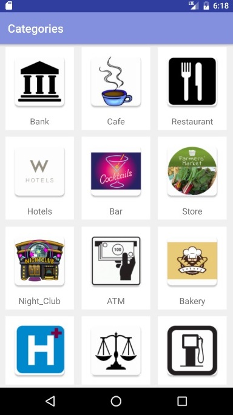
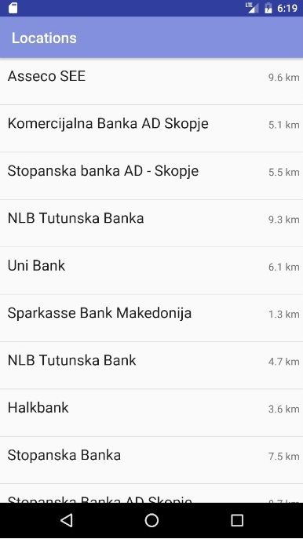
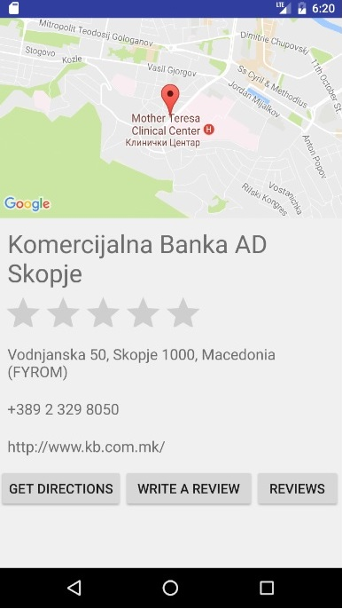
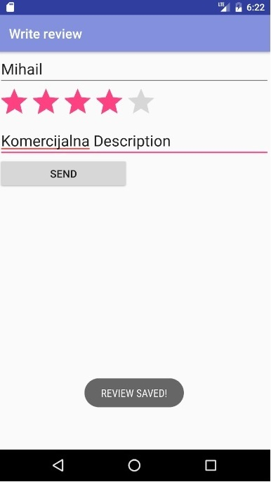
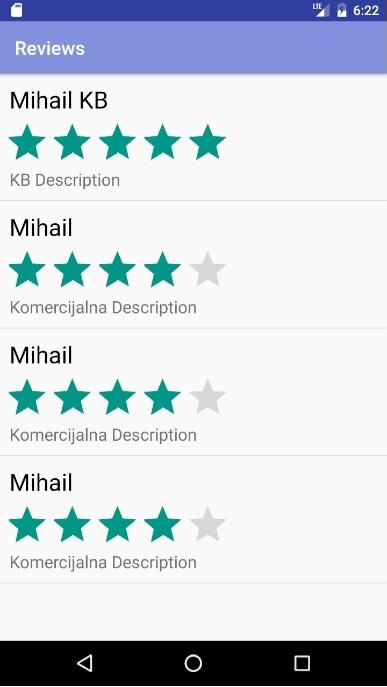

# DAS2016_Nearby
# Документација
## 1. Oпис на апликацијата ##
   Нашата мобилна апликација претставува пребарувач на локации. Апликацијата на корисниците ќе им овозможи пребарување на најблиските локации според одредена категорија (банки, ATMs, ресторани, менувачници, продавници итн.).

## 2. Функционални карактеристики на апликацијата
   Апликацијата ќе нуди избор на категории за локации, одалеченост од моменталната локација на корисникот, детали за локациите и рејтинг од корисниците.

### Кориснички сценарија
1. Корисникот на прв поглед (view), избира категорија за пребарување на локацијата. Потоа, во второто view на корисникот му се листаат сите најблиски локации, според одалеченоста. 
2. Дополнително, корисникот може да даде рејтинг за посетеното место и за апликацијата.
3.	Откако ќе се избере локација, корисникот може да избере на мапа да му се прикаже патот од тековната локација до избраната.

## 3. Упатство за користење на апликацијата ##
На сликата подолу е претставен основниот изглед на апликацијата (Слика 1), прикажани се 12 категории на локации за избор од страна на корисникот. Со избор на една од дадените категории се префрлуваме на второто View (Слика 2) каде што се листаат сите локации од избраната категорија (името на локацијата/местото и оддалеченоста во km). Доколку корисникот сака да добие подетални информации за локацијата може да кликне на една од локациите во листата и да му се отвори нов поглед (Слика 3), на кој му се нудат неколку опции. Во горната половина/сегмент од екранот му се прикажува местоположбата на локацијата на мапа, додека пак во долната половина му се прикажуваат подетални информации за локацијата (улица и број, телефон, еmail по потреба) и три копчиња- Get Directions, Write, Review.
Со притискање на првото копче Get Directions корисникот добива дирекции/насоки како да стигне до избраната локација (Слика 4), второто копче му отвара на корисникот нов поглед, во кој има опција да даде review- да остави коментар и оцена за локацијата (Слика 5), третото копче му дава можност на корисникот да ги погледне сите reviews за локацијата (Слика 6). 

### Погледи на апликацијата

  
  
  

Project for Software Design and Architecture course @ FCSE/FINKI
